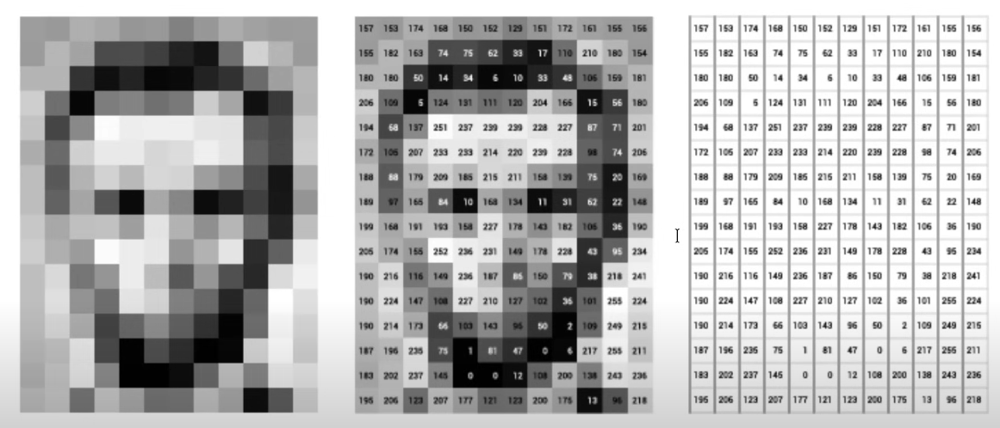

# Fundamentos de Tensores

## Definição de Tensor

**Tensores** são estruturas de dados que representam arrays multidimensionais. Eles generalizam as noções de escalares, vetores e matrizes para dimensões superiores, permitindo a representação de dados em várias dimensões.

- Um **escalar** é um número único (um tensor de ordem 0).
- Um **vetor** é um array unidimensional de números (um tensor de ordem 1).
- Uma **matriz** é um array bidimensional (um tensor de ordem 2).
- Um **tensor** de ordem superior pode ter três ou mais dimensões, possibilitando a manipulação de dados complexos em diversas áreas, como álgebra linear, física e aprendizado de máquina.

Em termos simples, um tensor é uma generalização dos conceitos de vetores e matrizes para dimensões superiores, onde as operações e manipulações matemáticas podem ser realizadas de forma eficiente.

### Exemplo de Uso de Tensores no Processamento de Imagens

Os tensores são amplamente utilizados em tarefas de processamento de imagens. Por exemplo, uma imagem colorida pode ser representada por um tensor tridimensional, onde as dimensões correspondem à altura, largura e canais de cor (RGB). Abaixo, temos uma ilustração de como um tensor pode ser aplicado no processamento de imagens:

